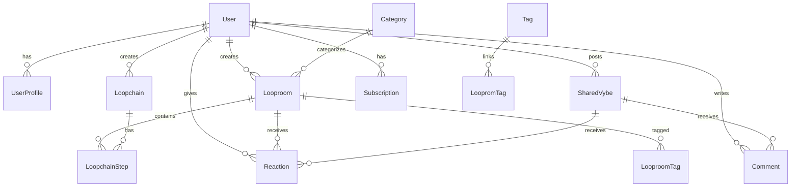

# VYBE LOOPROOMS™ - Database Schema Design

> **Database**: PostgreSQL  
> **ORM**: Prisma  
> **Version**: 1.0  
> **Updated**: September 11, 2025  

## 🏗️ Architecture Overview

This schema supports a **multi-tenant, social wellness platform** with emphasis on:
- **User Privacy & Anonymity**: Flexible identity management
- **Content & Creator Economy**: Looprooms, Loopchains, and monetization
- **Positive Social Interactions**: Shared VYBES feed with safety features
- **Scalable Engagement**: Optimized for high-read, social content workflows

---

## 📊 Core Entity Relationships



---

## 🗄️ Prisma Schema

```prisma
// This is your Prisma schema file,
// learn more about it in the docs: https://pris.ly/d/prisma-schema

generator client {
  provider = "prisma-client-js"
}

datasource db {
  provider = "postgresql"
  url      = env("DATABASE_URL")
}

// ================================
// USER MANAGEMENT & AUTHENTICATION
// ================================

enum UserRole {
  MEMBER
  CREATOR
  MODERATOR
  ADMIN
}

enum AuthProvider {
  EMAIL
  GOOGLE
  APPLE
}

enum PrivacyLevel {
  PUBLIC
  FRIENDS_ONLY
  PRIVATE
  ANONYMOUS
}

model User {
  id          String   @id @default(cuid())
  email       String   @unique
  username    String?  @unique
  role        UserRole @default(MEMBER)
  isVerified  Boolean  @default(false)
  isActive    Boolean  @default(true)
  
  // Authentication
  authProvider    AuthProvider
  authProviderId  String?
  passwordHash    String?
  emailVerifiedAt DateTime?
  
  // Privacy & Safety
  allowsAnonymousMode Boolean @default(true)
  defaultPrivacyLevel PrivacyLevel @default(PUBLIC)
  blockedUsers        String[] // Array of user IDs
  
  // Timestamps
  createdAt DateTime @default(now())
  updatedAt DateTime @updatedAt
  lastActiveAt DateTime @default(now())
  
  // Relations
  profile      UserProfile?
  looprooms    Looproom[]
  loopchains   Loopchain[]
  sharedVybes  SharedVybe[]
  reactions    Reaction[]
  comments     Comment[]
  subscriptions Subscription[]
  userProgress UserProgress[]
  looplistItems LooplistItem[]
  
  // Indexes
  @@map("users")
}

model UserProfile {
  id     String @id @default(cuid())
  userId String @unique
  
  // Basic Info
  firstName    String?
  lastName     String?
  displayName  String?
  bio          String?
  avatarUrl    String?
  
  // Wellness Profile
  currentMood     String? // JSON string for mood data
  wellnessGoals   String[] // Array of goal strings
  preferredCategories Category[]
  
  // Stats & Gamification
  totalStreakDays    Int @default(0)
  currentStreakDays  Int @default(0)
  completedLoopchains Int @default(0)
  vibesShared        Int @default(0)
  positiveReactions  Int @default(0)
  
  // Privacy Settings (overrides user defaults)
  showStats        Boolean @default(true)
  showProgress     Boolean @default(true)
  allowDirectMessages Boolean @default(true)
  
  // Timestamps
  createdAt DateTime @default(now())
  updatedAt DateTime @updatedAt
  
  // Relations
  user User @relation(fields: [userId], references: [id], onDelete: Cascade)
  
  @@map("user_profiles")
}

// ================================
// CONTENT STRUCTURE
// ================================

enum ContentType {
  VIDEO
  AUDIO
  TEXT
  MIXED
}

enum LooproomStatus {
  DRAFT
  PUBLISHED
  ARCHIVED
  RESTRICTED
}

model Category {
  id          String @id @default(cuid())
  name        String @unique
  slug        String @unique
  description String?
  color       String? // Hex color for UI
  iconUrl     String?
  sortOrder   Int     @default(0)
  isActive    Boolean @default(true)
  
  // Relations
  looprooms    Looproom[]
  userProfiles UserProfile[]
  
  @@map("categories")
}

model Tag {
  id   String @id @default(cuid())
  name String @unique
  slug String @unique
  
  // Relations
  looproomTags LooproomTag[]
  
  @@map("tags")
}

model Looproom {
  id          String         @id @default(cuid())
  title       String
  slug        String         @unique
  description String?
  thumbnail   String?
  contentType ContentType
  contentUrl  String
  duration    Int? // Duration in seconds
  status      LooproomStatus @default(DRAFT)
  
  // Creator & Attribution
  creatorId   String
  creator     User     @relation(fields: [creatorId], references: [id])
  
  // Categorization
  categoryId  String
  category    Category @relation(fields: [categoryId], references: [id])
  
  // Engagement & Stats
  viewCount      Int @default(0)
  reactionCount  Int @default(0)
  shareCount     Int @default(0)
  averageRating  Float? // 1-5 stars, optional
  
  // Content Metadata
  transcription  String? // For accessibility
  keywords       String[] // Search optimization
  difficulty     String? // "Beginner", "Intermediate", "Advanced"
  
  // Premium Features
  isPremium      Boolean @default(false)
  previewDuration Int? // Seconds of free preview
  
  // Timestamps
  createdAt DateTime @default(now())
  updatedAt DateTime @updatedAt
  publishedAt DateTime?
  
  // Relations
  tags           LooproomTag[]
  reactions      Reaction[]
  loopchainSteps LoopchainStep[]
  sharedVybes    SharedVybe[]
  looplistItems  LooplistItem[]
  
  @@map("looprooms")
}

model LooproomTag {
  id         String @id @default(cuid())
  looproomId String
  tagId      String
  
  // Relations
  looproom Looproom @relation(fields: [looproomId], references: [id], onDelete: Cascade)
  tag      Tag      @relation(fields: [tagId], references: [id], onDelete: Cascade)
  
  @@unique([looproomId, tagId])
  @@map("looproom_tags")
}

// ================================
// LOOPCHAINS (GUIDED JOURNEYS)
// ================================

enum LoopchainStatus {
  DRAFT
  PUBLISHED
  ARCHIVED
}

model Loopchain {
  id          String          @id @default(cuid())
  title       String
  slug        String          @unique
  description String?
  thumbnail   String?
  status      LoopchainStatus @default(DRAFT)
  
  // Creator
  creatorId String
  creator   User   @relation(fields: [creatorId], references: [id])
  
  // Journey Metadata
  estimatedDuration Int? // Total minutes to complete
  difficulty        String? // "Beginner", "Intermediate", "Advanced"
  goals             String[] // Array of wellness goals this addresses
  
  // Engagement
  enrollmentCount Int @default(0)
  completionCount Int @default(0)
  averageRating   Float?
  
  // Premium
  isPremium Boolean @default(false)
  
  // Timestamps
  createdAt   DateTime @default(now())
  updatedAt   DateTime @updatedAt
  publishedAt DateTime?
  
  // Relations
  steps        LoopchainStep[]
  userProgress UserProgress[]
  
  @@map("loopchains")
}

model LoopchainStep {
  id           String @id @default(cuid())
  loopchainId  String
  looproomId   String
  stepNumber   Int
  title        String?
  description  String?
  isOptional   Boolean @default(false)
  
  // Step-specific settings
  minCompletionTime Int? // Minimum seconds to consider "completed"
  requiresInteraction Boolean @default(false)
  
  // Relations
  loopchain Loopchain @relation(fields: [loopchainId], references: [id], onDelete: Cascade)
  looproom  Looproom  @relation(fields: [looproomId], references: [id])
  userProgress UserProgress[]
  
  @@unique([loopchainId, stepNumber])
  @@map("loopchain_steps")
}

// ================================
// USER PROGRESS & ENGAGEMENT
// ================================

enum ProgressStatus {
  NOT_STARTED
  IN_PROGRESS
  COMPLETED
  SKIPPED
}

model UserProgress {
  id              String         @id @default(cuid())
  userId          String
  loopchainId     String
  loopchainStepId String?
  status          ProgressStatus @default(NOT_STARTED)
  
  // Progress Tracking
  currentStep     Int @default(1)
  completedSteps  Int @default(0)
  totalSteps      Int
  progressPercent Float @default(0)
  
  // Engagement Metrics
  timeSpent       Int @default(0) // Total seconds spent
  confidenceLevel Int? // 1-10 self-reported confidence
  moodBefore      String? // JSON mood data
  moodAfter       String? // JSON mood data
  
  // Timestamps
  startedAt   DateTime @default(now())
  lastActiveAt DateTime @default(now())
  completedAt DateTime?
  
  // Relations
  user          User           @relation(fields: [userId], references: [id], onDelete: Cascade)
  loopchain     Loopchain      @relation(fields: [loopchainId], references: [id], onDelete: Cascade)
  loopchainStep LoopchainStep? @relation(fields: [loopchainStepId], references: [id])
  
  @@unique([userId, loopchainId])
  @@map("user_progress")
}

// ================================
// SHARED VYBES (SOCIAL FEED)
// ================================

enum SharedVybeType {
  REFLECTION
  MILESTONE
  INSPIRATION
  GRATITUDE
  PROGRESS_UPDATE
}

model SharedVybe {
  id      String         @id @default(cuid())
  userId  String
  type    SharedVybeType @default(REFLECTION)
  content String // Main post content
  
  // Privacy & Safety
  isAnonymous Boolean @default(false)
  privacyLevel PrivacyLevel @default(PUBLIC)
  
  // Content Association
  looproomId  String? // Optional link to related Looproom
  loopchainId String? // Optional link to related Loopchain
  
  // Engagement
  reactionCount Int @default(0)
  commentCount  Int @default(0)
  shareCount    Int @default(0)
  
  // Moderation
  isReported    Boolean @default(false)
  reportCount   Int @default(0)
  moderatedAt   DateTime?
  moderatorNote String?
  
  // Timestamps
  createdAt DateTime @default(now())
  updatedAt DateTime @updatedAt
  
  // Relations
  user      User       @relation(fields: [userId], references: [id], onDelete: Cascade)
  looproom  Looproom?  @relation(fields: [looproomId], references: [id])
  reactions Reaction[]
  comments  Comment[]
  
  @@map("shared_vybes")
}

// ================================
// SOCIAL INTERACTIONS
// ================================

enum ReactionType {
  HEART
  CLAP
  FIRE
  PEACE
  INSPIRE
  STRENGTH
  GRATITUDE
  MINDFUL
}

enum ReactableType {
  LOOPROOM
  SHARED_VYBE
  COMMENT
}

model Reaction {
  id           String        @id @default(cuid())
  userId       String
  type         ReactionType
  reactableType ReactableType
  reactableId  String
  isAnonymous  Boolean @default(false)
  
  // Timestamps
  createdAt DateTime @default(now())
  
  // Relations
  user        User        @relation(fields: [userId], references: [id], onDelete: Cascade)
  looproom    Looproom?   @relation(fields: [reactableId], references: [id], onDelete: Cascade)
  sharedVybe  SharedVybe? @relation(fields: [reactableId], references: [id], onDelete: Cascade)
  
  // Prevent duplicate reactions from same user
  @@unique([userId, reactableType, reactableId, type])
  @@map("reactions")
}

model Comment {
  id           String @id @default(cuid())
  userId       String
  sharedVybeId String
  content      String
  isAnonymous  Boolean @default(false)
  
  // Moderation
  isReported    Boolean @default(false)
  reportCount   Int @default(0)
  moderatedAt   DateTime?
  moderatorNote String?
  
  // Timestamps
  createdAt DateTime @default(now())
  updatedAt DateTime @updatedAt
  
  // Relations
  user       User       @relation(fields: [userId], references: [id], onDelete: Cascade)
  sharedVybe SharedVybe @relation(fields: [sharedVybeId], references: [id], onDelete: Cascade)
  
  @@map("comments")
}

// ================================
// USER COLLECTIONS & FAVORITES
// ================================

model LooplistItem {
  id         String @id @default(cuid())
  userId     String
  looproomId String
  
  // Organization
  notes      String?
  isFavorite Boolean @default(false)
  
  // Timestamps
  createdAt DateTime @default(now())
  
  // Relations
  user     User     @relation(fields: [userId], references: [id], onDelete: Cascade)
  looproom Looproom @relation(fields: [looproomId], references: [id], onDelete: Cascade)
  
  @@unique([userId, looproomId])
  @@map("looplist_items")
}

// ================================
// SUBSCRIPTION & MONETIZATION
// ================================

enum SubscriptionStatus {
  ACTIVE
  CANCELED
  EXPIRED
  TRIAL
}

enum SubscriptionTier {
  FREE
  PREMIUM_MONTHLY
  PREMIUM_YEARLY
  CREATOR_PRO
}

model Subscription {
  id       String             @id @default(cuid())
  userId   String
  tier     SubscriptionTier
  status   SubscriptionStatus @default(TRIAL)
  
  // Billing
  stripeCustomerId     String?
  stripeSubscriptionId String?
  priceId              String?
  currentPeriodStart   DateTime
  currentPeriodEnd     DateTime
  cancelAtPeriodEnd    Boolean @default(false)
  
  // Trial
  trialStart DateTime?
  trialEnd   DateTime?
  
  // Timestamps
  createdAt DateTime @default(now())
  updatedAt DateTime @updatedAt
  
  // Relations
  user User @relation(fields: [userId], references: [id], onDelete: Cascade)
  
  @@unique([userId])
  @@map("subscriptions")
}

// ================================
// SYSTEM & MODERATION
// ================================

enum ReportType {
  SPAM
  HARASSMENT
  INAPPROPRIATE_CONTENT
  SAFETY_CONCERN
  COPYRIGHT
  OTHER
}

enum ReportStatus {
  PENDING
  REVIEWED
  RESOLVED
  DISMISSED
}

model Report {
  id          String       @id @default(cuid())
  reporterId  String
  reportedType String      // 'user', 'shared_vybe', 'comment', etc.
  reportedId  String
  type        ReportType
  status      ReportStatus @default(PENDING)
  description String?
  
  // Moderation
  reviewedBy   String? // Admin/Moderator user ID
  reviewedAt   DateTime?
  resolution   String?
  actionTaken  String?
  
  // Timestamps
  createdAt DateTime @default(now())
  updatedAt DateTime @updatedAt
  
  @@map("reports")
}

// ================================
// ANALYTICS & INSIGHTS
// ================================

model UserSession {
  id        String   @id @default(cuid())
  userId    String
  sessionId String
  userAgent String?
  ipAddress String?
  
  // Session Data
  startTime    DateTime @default(now())
  endTime      DateTime?
  duration     Int? // Seconds
  pageViews    Int @default(1)
  interactions Int @default(0)
  
  @@map("user_sessions")
}

model ContentAnalytics {
  id         String   @id @default(cuid())
  contentType String  // 'looproom', 'shared_vybe', etc.
  contentId  String
  date       DateTime @default(now())
  
  // Metrics
  views      Int @default(0)
  reactions  Int @default(0)
  comments   Int @default(0)
  shares     Int @default(0)
  completions Int @default(0) // For Looprooms
  
  @@unique([contentType, contentId, date])
  @@map("content_analytics")
}

// ================================
// INDEXES FOR PERFORMANCE
// ================================

// Note: Additional indexes will be added based on query patterns:
// - User activity queries (lastActiveAt, createdAt)
// - Content discovery (category, tags, status)
// - Social feed (createdAt, privacyLevel, userId)
// - Search functionality (title, description, keywords)
// - Analytics and reporting (date ranges, user segments)
```

---

## 🔍 Key Schema Design Decisions

### **1. Privacy-First Architecture**
- **Flexible Anonymity**: Users can post/react anonymously without creating separate accounts
- **Granular Privacy**: Different privacy levels per content type
- **Data Minimization**: Optional fields for sensitive information

### **2. Positive Social Environment**
- **Positive-Only Reactions**: Curated emotion types, no negative options
- **Report System**: Comprehensive moderation without public negative feedback
- **Community Safety**: Built-in blocking and content filtering

### **3. Creator Economy Support**
- **Attribution Tracking**: Clear creator ownership and analytics
- **Monetization Ready**: Subscription tiers and premium content flags
- **Performance Analytics**: Detailed engagement metrics for creators

### **4. Scalable Engagement**
- **Optimized Reads**: Denormalized counts for social features
- **Efficient Queries**: Strategic indexing for discovery and feeds
- **Analytics Separation**: Dedicated tables for performance data

### **5. Wellness-Focused Features**
- **Progress Tracking**: Detailed journey completion metrics
- **Mood Integration**: Before/after emotional state capture
- **Goal Alignment**: Content recommendation based on wellness objectives

---

## 📊 Performance Considerations

### **Database Indexes (Additional to Prisma defaults)**
```sql
-- User activity and discovery
CREATE INDEX idx_users_last_active ON users(last_active_at DESC);
CREATE INDEX idx_users_role_active ON users(role, is_active);

-- Content discovery
CREATE INDEX idx_looprooms_category_status ON looprooms(category_id, status, created_at DESC);
CREATE INDEX idx_looprooms_creator_status ON looprooms(creator_id, status, created_at DESC);
CREATE INDEX idx_looprooms_premium_status ON looprooms(is_premium, status, view_count DESC);

-- Social feed performance
CREATE INDEX idx_shared_vybes_privacy_created ON shared_vybes(privacy_level, created_at DESC);
CREATE INDEX idx_shared_vybes_user_created ON shared_vybes(user_id, created_at DESC);
CREATE INDEX idx_reactions_user_type ON reactions(user_id, reactable_type, created_at DESC);

-- Search optimization
CREATE INDEX idx_looprooms_search ON looprooms USING gin(to_tsvector('english', title || ' ' || description));
```

### **Query Optimization Strategies**
- **Pagination**: Cursor-based pagination for infinite scroll feeds
- **Caching**: Redis caching for trending content and user sessions
- **Read Replicas**: Separate read/write databases for high-traffic queries
- **Connection Pooling**: Prisma connection pooling for concurrent requests

---

## 🔐 Security & Compliance

### **Data Protection**
- **PII Encryption**: Sensitive fields encrypted at rest
- **Audit Logging**: User data access and modification tracking
- **Data Retention**: Configurable data deletion policies
- **GDPR Compliance**: User data export and deletion capabilities

### **Access Control**
- **Row-Level Security**: PostgreSQL RLS for multi-tenant data isolation
- **API Rate Limiting**: User and IP-based request limiting
- **Input Validation**: Prisma schema validation + application-level checks
- **SQL Injection Prevention**: Parameterized queries via Prisma

---

This schema provides a solid foundation for VYBE LOOPROOMS™ while maintaining flexibility for future feature additions and optimizations.
